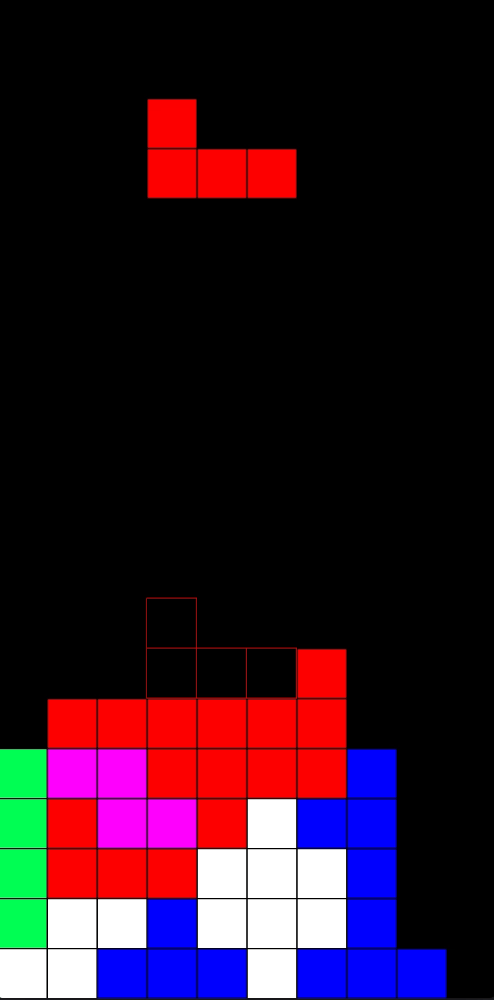

# Tetrust

A clone of a famous block breaking game.

## Current Features

* Basic gameplay
  * Tetrinome translations
  * Tetrinome rotations
  * Line clearings
* Fancy Animations
  * Line clearings
  * Instant drops
* Shadow piece
* Instant drops
* Implemented in pure Rust and ggez

## Potential Future Features

For now I'm satisfied with what the I achieved considering it was a side project to try out game development and Rust, but here are future features I would add if I return to the project:

* State management system
  * Pause state
  * Game Over state
* Next tetrinome queue
* Sounds & music
